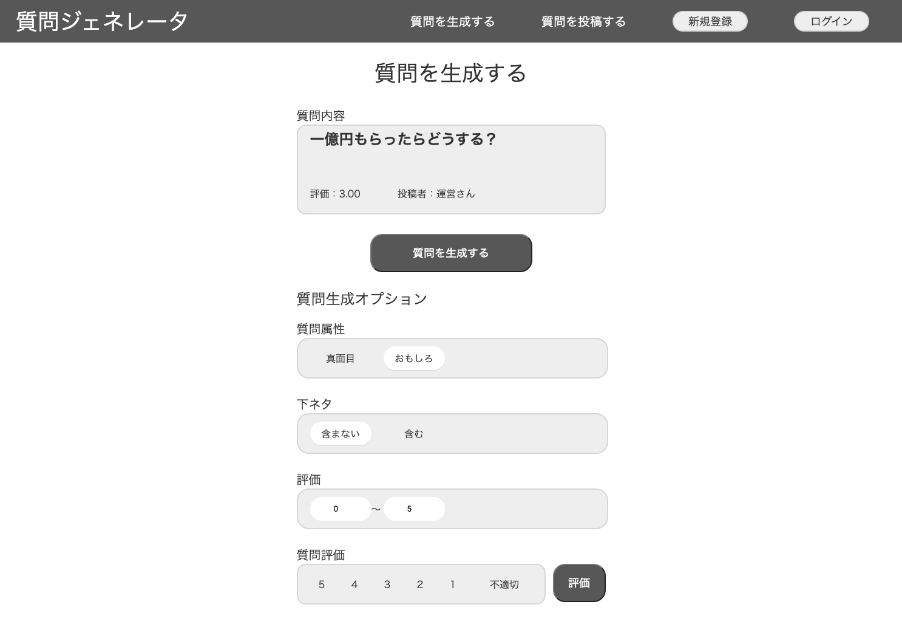
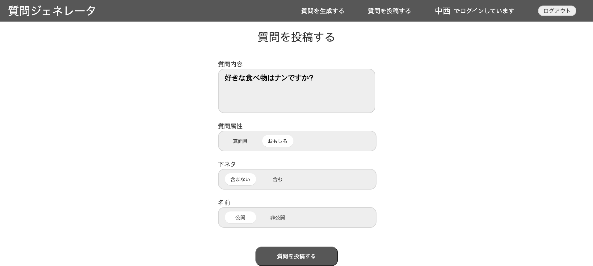

# question_generator（質問ジェネレータ）

会話のネタを提供し、気まずい時間をなくすことを目的とした質問生成ツールです。 
調整完了次第、公開する予定です。

## 使い方

 

 
## スクリーンショット 
 

 
 
## 使い方
 

**質問生成機能(generator_4.php)** 
「質問を生成するボタン」をクリックすることで、DBに登録された質問をランダムで1つ表示することができます。 
その際、質問生成オプションの3つ条件（真面目/おもしろ、下ネタを含む/含まない、評価）で表示させる質問を絞り込むことができます。  

**質問評価機能(generator_4.php)** 
「質問評価」の6つのラジオボタンを選択し、「評価ボタン」を押すと質問を評価することができます。 
評価の計算方法は 今までの評価の合計 ÷　　今まで評価された回数 です。 
また、質問を投稿した際、デフォルトで評価は3、評価された回数は1となります。  

**質問投稿機能（question_post.php）** 
質問をフォームに記入し、属性、下ネタ、名前の公開を設定して「質問を投稿するボタン」を押すことで、DBに質問を登録することができます。 
質問を投稿する際に、ログインが必須となっており、ログインしていない状態でこのページに行くと、ログイン画面に遷移します。
 
## 著者
 
* Nakanishi
* 23卒
* [Twitter](https://twitter.com/Nakana_design)
